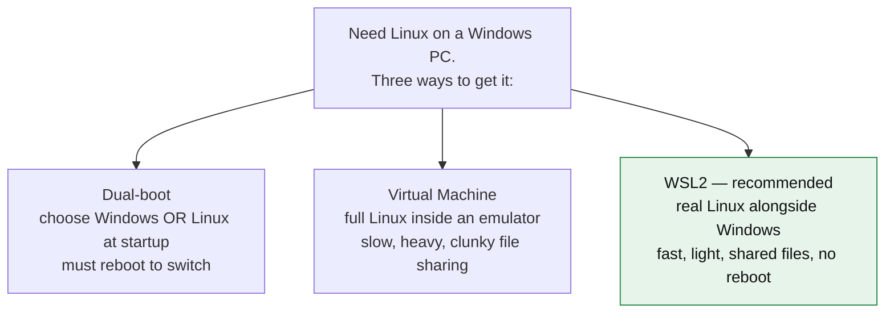
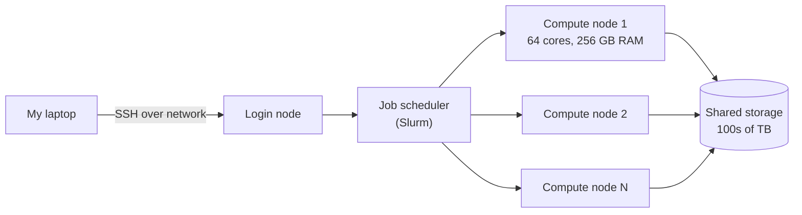
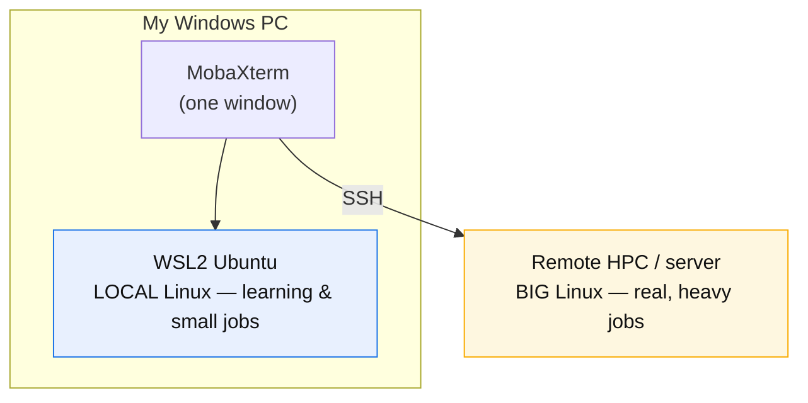
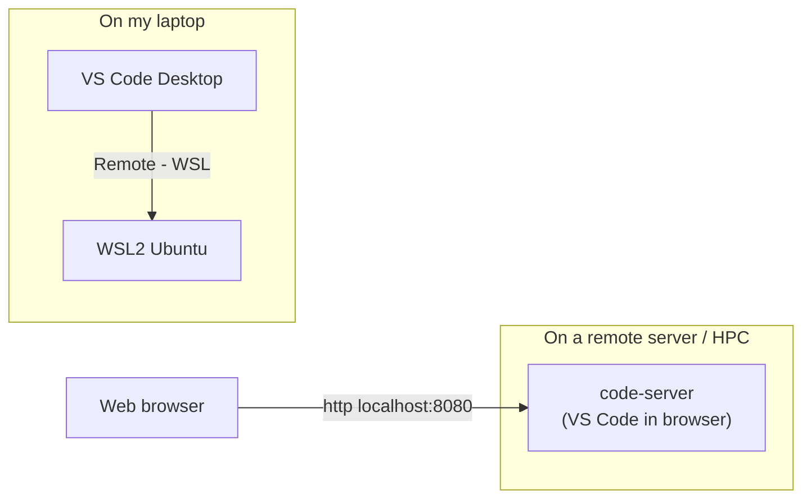

# 🧬 Day 1 — Bioinformatics Workflow Setup: Building Your Computational Foundation

> **Week 1, Day 1** · Friday, July 3, 2026  
> **Notes by:** Naznin Akter<br>
> **Course material & scripts:** Md. Jubayer Hossain (DeepBio Academy)
---

## 🎯 Learning Checklist
- [1] Set up Linux subsystem (WSL2) & MobaXterm
- [2] Configure Conda, Bioconda, Pixi, and uv package managers
- [3] Set up VS Code and RStudio for reproducible coding
- [4] Integrate GitHub Copilot & Claude Code AI tools
- [5] Master basic Git commands and GitHub repository pushing
---

## 🔍 Prerequisites (System Requirements)
- **A Windows 10 or Windows 11 PC** with administrator rights and internet access.
- **~10 GB free disk** and the patience to reboot once.
- **System Verification:** Open **PowerShell** to verify Windows build compatibility with WSL2:

```powershell
winver
```
> ⚠️ Required version: Version 2004 (build 19041) or higher. Anything from 2021 onward is fine.
---

## 🧠 1. Fundamental Concepts
### 🐧 1.1 What is Linux?
Linux is a **free & open-source operating system (OS)** that manages hardware, memory, and file access. Unlike Windows or macOS, most operations in Linux are driven through text-based commands.

Think of the operating system as the ground floor everything else stands on:
```
   ┌─────────────────────────────────────────┐
   │   Your programs (samtools, R, Python)    │  ← the tools you run
   ├─────────────────────────────────────────┤
   │   Operating System (Linux / Windows)     │  ← manages files, memory, CPU
   ├─────────────────────────────────────────┤
   │   Hardware (CPU, RAM, disk)              │  ← the physical machine
   └─────────────────────────────────────────┘
```
Two ways to give an OS instructions:
- **GUI** = *Graphical User Interface* — Mouse clicks, buttons, and interactive windows.
- **CLI** = *Command-Line Interface* — Typing direct text commands. Bioinformatics relies on CLI for performance, automation, and remote server access.

### 🔓 Why Linux for bioinformatics?
| Reason | What it means |
|--------|-----------------------|
| **Tools are built for it** | Aligners, variant callers, Bioconda's ~10,000 packages ship as Linux binaries first (often *only*). |
| **Free & no admin walls** | Install thousands of tools without buying licenses or fighting admin permissions. |
| **Reproducible & scriptable** | A workflow is just text commands — save them, re-run them, share them, and get identical results. |
| **It runs the big machines** | Lab servers, HPC clusters, and cloud (AWS/Google) are ~all Linux. Learn it once, use it everywhere. |
| **What papers publish** | Methods sections list Linux commands. I can reproduce published pipelines directly. |
---

### 💻 1.2 What is WSL? Why WSL?
Bioinformatics requires Linux, but my laptop runs **Windows**. I have three ways to get Linux onto my Windows PC:


**WSL = Windows Subsystem for Linux.** Version 2 (**WSL2**) runs a **real Ubuntu Linux kernel** seamlessly inside Windows — no separate boot or clunky emulator required. I simply open a terminal and I am in Linux, while my Windows apps continue running normally alongside it.

**Why WSL (over the other two):**
- **No reboot** — Linux and Windows run at the same time.
- **Fast & light** — near-native speed, minimal setup.
- **Shared files** — My Windows files are directly accessible from Linux, and vice versa.
- **Free & official** — built and maintained by Microsoft; one command installs it.

```
        My Windows Laptop
   ┌───────────────────────────────┐
   │  Windows apps   │   WSL2       │
   │  (browser,      │   Ubuntu     │
   │   Office, …)    │   (Linux     │
   │                 │    terminal) │
   └───────────────────────────────┘
        both run at the same time
```
So: **WSL2 = My personal Linux, living inside Windows.** This is my *local* Linux for everyday work.
---

### 🚀 1.3 What is HPC? Why HPC?
My laptop is fine for learning, but real datasets are **big** — aligning a human genome can need 32+ GB of RAM and many CPU cores, running for hours. A laptop chokes. Enter **HPC**.
**HPC = High-Performance Computing.** An HPC **cluster** is a large collection of powerful computers ("nodes") wired together in a data center, sharing huge storage — designed to run heavy jobs fast, for many users at once.



Laptop vs HPC, at a glance:

```
   Laptop                         HPC cluster
   ┌──────────┐                   ┌──────────┬──────────┬──────────┐
   │ 4–8 cores│                   │ 64 cores │ 64 cores │ 64 cores │
   │ 8–16 GB  │        vs         │  256 GB  │  256 GB  │  256 GB  │  … ×100s
   │ 1 disk   │                   │   shared petabyte storage      │
   └──────────┘                   └──────────┴──────────┴──────────┘
   good for learning              good for real genomics at scale
```

**Why HPC:**
- **Power** — dozens of cores and hundreds of GB of RAM per node handle genome-scale data.
- **Speed & parallelism** — run many samples at once instead of one-by-one on a laptop.
- **Big storage** — datasets are hundreds of GB to TB; clusters have the room.
- **Runs unattended** — submit a job, log off, collect results later.

**How can I access an HPC:** I do not sit in front of the physical hardware. Instead, I connect **remotely from my laptop using SSH**. Because the HPC runs Linux, the exact same commands and tools I learn on my local WSL2 setup apply directly to the remote cluster.
---

### 🛠️ Putting it together — the two Linuxes
I drive **two** distinct Linux environments from a single terminal application (MobaXterm):


Same commands, same tools, two places to run them.
---

## 🎯 2. Setup check
Only need Windows + internet to start. Confirm internet and admin PowerShell:

Open **Start → type "PowerShell" → right-click → Run as administrator**. Then:

```powershell
wsl --status
```
**Expected output** - Bbefore install it may say WSL is not installed — that is fine, fix it in Step 1:

```
Default Distribution: <none or Ubuntu>
Default Version: 2
```
✅ **Checkpoint:** an admin PowerShell window is open and responds.

## 🐙 3. Step-by-step walkthrough

### 💡Step 1 — Install Windows Subsystem for Linux (WSL2 + Ubuntu)
**What & why:** This installs a native Ubuntu Linux environment inside Windows, serving as my primary command-line terminal for the entire program.
In the **administrator PowerShell**, run:

```powershell
wsl --install
```
This one command enables the needed Windows features, installs WSL2, and installs **Ubuntu** by default.

**Expected output** (abridged):

```
Installing: Virtual Machine Platform
Installing: Windows Subsystem for Linux
Installing: Ubuntu
The requested operation is successful. Changes will not be effective until the system is rebooted.
```
**Reboot PC now.** After reboot, Ubuntu launches automatically and asks to create a Linux user:

```
Enter new UNIX username: student
New password:
Retype new password:
```

> ⚠️ The password is **invisible** — that is normal Linux behavior, not a frozen screen. Remember this password; need it for `sudo` (admin) commands.

Verify the version is **2**:

```powershell
wsl --list --verbose
```

**Expected output:**

```
  NAME      STATE           VERSION
* Ubuntu    Running         2
```

If it shows `VERSION 1`, upgrade it:

```powershell
wsl --set-version Ubuntu 2
wsl --set-default-version 2
```
Now update Ubuntu's own package list (inside the Ubuntu terminal):

```bash
sudo apt update && sudo apt upgrade -y
```

✅ **Checkpoint:** `wsl -l -v` shows Ubuntu, State **Running**, Version **2**, and have a bash prompt like `student@PC:~$`.
---

### 💡Step 2 — Install MobaXterm (Windows)

**What & why:** WSL gives a terminal, but **MobaXterm** gives one comfortable window for WSL shell, remote SSH servers, and drag-and-drop file transfer.

1. Open a browser to **https://mobaxterm.mobatek.net/download-home-edition.html**.
2. Download **MobaXterm Home Edition → Installer edition** (not the Portable edition, so it stays installed).
3. Unzip the downloaded file, run the `.msi` installer, click **Next → Next → Install → Finish**.
4. Launch **MobaXterm** from the Start menu.

**What we will see:** a window with a left **Sessions** sidebar and a big terminal area. MobaXterm auto-detects **WSL Ubuntu** — look under the left sidebar for a **WSL / Ubuntu** entry.

Open local Linux inside MobaXterm:

- Click the **WSL** icon (or **Session → WSL → Ubuntu → OK**).

```bash
lsb_release -a
```
**Expected output:**

```
Distributor ID: Ubuntu
Description:    Ubuntu 22.04.x LTS
Release:        22.04
Codename:       jammy
```
✅ **Checkpoint:** MobaXterm is open and shows Ubuntu bash prompt.
---

### 💡Step 3 — Remote login using MobaXterm (SSH)
**What & why:** real analyses often run on a **remote server** (a lab machine or cloud instance) with more CPU/RAM than laptop. SSH is how open a terminal there. *(If mentor has not given a server yet, read this step now and practice it when receive credentials — it is required knowledge, not optional.)*

Need three things from whoever owns the server: **host** (an address like `hpc.university.edu` or an IP `203.0.113.10`), **username**, and either a **password** or an **SSH key**.

**Create an SSH session in MobaXterm:**

1. Click **Session** (top-left) → **SSH**.
2. **Remote host:** paste the host, e.g. `hpc.university.edu`.
3. Tick **Specify username** → type your server username.
4. Leave **Port** at `22` (the standard SSH port).
5. Click **OK**.

MobaXterm connects and prompts:

```
login as: <username>
<username>@hpc.university.edu's password:
```

Type password (invisible) and press Enter.

**Expected output** (a welcome banner + a prompt on the *remote* machine):

```
Welcome to the Bio-HPC cluster
Last login: Fri Jul  3 09:12:03 2026 from 203.0.113.5
<username>@hpc:~$
```
Confirm that my session are really on the remote machine, not laptop:

```bash
hostname
```
**Expected output:**

```
hpc
```

**Move a file to the server:** MobaXterm shows an SFTP file browser on the left — **drag a file from Windows into it** to upload, or from it to Windows to download. Command-line equivalent, run from **WSL** terminal:

```bash
scp myfile.txt <username>@hpc.university.edu:/home/<username>/
```

> **Key-based login (recommended, no password each time).** Generate a key once in WSL, then copy the public half to the server:
> ```bash
> ssh-keygen -t ed25519 -C "you@example.com"   # press Enter for defaults
> ssh-copy-id <username>@hpc.university.edu        # paste password once
> ssh <username>@hpc.university.edu                 # now logs in with no password
> ```
✅ **Checkpoint:** `hostname` on the SSH session prints the **server's** name, different from laptop.
---

### 💡Step 4 — Install Miniconda on Ubuntu

**What & why:** **Miniconda** provides a lightweight environment and package management system `(conda)`. It allows me to install bioinformatics tools in isolated user environments without needing system-level `sudo` permissions.

Run these **in Ubuntu (WSL) terminal**. First download the Linux 64-bit installer:

```bash
cd ~
wget https://repo.anaconda.com/miniconda/Miniconda3-latest-Linux-x86_64.sh
```

**Expected output** (ends with):

```
'Miniconda3-latest-Linux-x86_64.sh' saved
```

Run the installer:

```bash
bash Miniconda3-latest-Linux-x86_64.sh
```

- Press **Enter** to read the license, hold **Enter/Space** to scroll, type **yes** to accept.
- Accept the default install location (`/home/<username>/miniconda3`) with **Enter**.
- When asked *"Do you wish to update your shell profile to automatically initialize conda?"* type **yes**.

Reload your shell so `conda` is on the PATH:

```bash
source ~/.bashrc
```

Verify:

```bash
conda --version
```

**Expected output:**

```
conda 24.x.x
```

Stop conda from auto-activating `base` on every new terminal (keeps prompts clean):

```bash
conda config --set auto_activate_base false
```
✅ **Checkpoint:** `conda --version` prints a version number.
---

### 💡Step 5 — Install Bioconda on Ubuntu (channels + fast solver)

**What & why:** **Bioconda** is the catalog of bioinformatics tools. Enable it by adding three **channels** in the correct priority, then install the fast **mamba** solver so environment-building takes seconds instead of minutes.

Add the channels **in this exact order** (order sets priority):

```bash
conda config --add channels defaults
conda config --add channels bioconda
conda config --add channels conda-forge
conda config --set channel_priority strict
```

> Order matters: after these commands `conda-forge` is highest priority, then `bioconda`, then `defaults`. `strict` priority is the officially recommended Bioconda setup and prevents most "unsolvable environment" errors.

Confirm the channel list:

```bash
conda config --show channels
```

**Expected output:**

```
channels:
  - conda-forge
  - bioconda
  - defaults
```

Install **mamba** (a drop-in, much faster replacement for `conda`) into base:

```bash
conda install -n base -c conda-forge mamba -y
```

Test Bioconda by installing a real tool, **samtools**, into a throwaway environment:

```bash
mamba create -n test-bio samtools -y
mamba activate test-bio
samtools --version | head -n 1
```

**Expected output:**

```
samtools 1.x
```

Clean up the test:

```bash
mamba deactivate
mamba env remove -n test-bio -y
```
✅ **Checkpoint:** `samtools --version` printed successfully from a Bioconda-installed package.
---

### 💡Step 6 — Reproducible package management for bioinformatics (`environment.yml`)

**What & why:** Typing `mamba install` by hand is not reproducible — All forget which versions used. Instead, describe tools in a small text file, `environment.yml`, and build the environment **from the file**. Anyone recreates the identical toolset with one command.

Create the file with a text editor. In WSL use `nano`:

```bash
nano environment.yml
```

Paste this (a starter environment for the RNA-seq sessions):

```yaml
name: bmp-rnaseq
channels:
  - conda-forge
  - bioconda
  - defaults
dependencies:
  - python=3.11
  - samtools=1.20
  - bcftools=1.20
  - bedtools=2.31
  - fastqc=0.12
  - fastp=0.23
  - salmon=1.10
  - multiqc=1.21
```

Save in nano with **Ctrl+O → Enter**, exit with **Ctrl+X**.

Build the environment **from the file**:

```bash
mamba env create -f environment.yml
```

**Expected output** (ends with):

```
done
#
# To activate this environment, use
#     $ mamba activate bmp-rnaseq
```

Activate and verify:

```bash
mamba activate bmp-rnaseq
which samtools
```

**Expected output** (path inside the env, not the system):

```
/home/<username>/miniconda3/envs/bmp-rnaseq/bin/samtools
```

**Export an exact snapshot** so a collaborator gets identical versions:

```bash
mamba env export --no-builds > environment.lock.yml
```

This writes every package and version. Commit `environment.yml` (human-edited) and `environment.lock.yml` (exact snapshot) to git.

> **Modern alternative — Pixi.** Newer projects increasingly use **[Pixi](https://pixi.sh)**, which reads the same conda/bioconda channels but writes a `pixi.lock` automatically and installs into a per-project `.pixi/` folder. Same idea, tighter reproducibility. `conda`/`mamba` + `environment.yml` remains the most widely documented approach and is what we use in this cohort.
✅ **Checkpoint:** `mamba activate bmp-rnaseq` works and `which samtools` points inside `envs/bmp-rnaseq`.
---

### 💡Step 7 — Reproducible package management for Python (`uv`)
**What & why:** conda handles bioinformatics **binaries**; for pure-**Python** projects (pandas, scanpy, my own scripts) the modern reproducible tool is **`uv`** — extremely fast, and it writes a `uv.lock` that pins every dependency for exact reproducibility.

Install `uv` inside WSL:

```bash
curl -LsSf https://astral.sh/uv/install.sh | sh
source ~/.bashrc
uv --version
```

**Expected output:**

```
uv 0.x.x
```

Create a reproducible Python project:

```bash
mkdir ~/bmp-python && cd ~/bmp-python
uv init
uv add pandas numpy matplotlib
```

**Expected output** (abridged):

```
Initialized project `bmp-python`
Resolved N packages ...
Installed N packages
```

`uv` created three key files:

- `pyproject.toml` — my declared dependencies (human-edited).
- `uv.lock` — the exact resolved versions (auto-managed; **commit it**).
- `.venv/` — the isolated virtual environment (do **not** commit).

Run Python inside the project without manually activating anything:

```bash
uv run python -c "import pandas as pd; print(pd.__version__)"
```

**Expected output:**

```
2.x.x
```

A collaborator reproduces my exact environment by cloning the repo and running:

```bash
uv sync
```
✅ **Checkpoint:** `uv run python -c "import pandas"` prints a version, and `uv.lock` exists in the project.

---

### 💡Step 8 — Install a code editor: VS Code (+ extensions, + browser version)
**What & why:** Need a place to **write and run code**. **VS Code** (Visual Studio Code) is the free, standard editor for bioinformatics: it edits files, opens a terminal, connects straight into WSL, and adds superpowers through **extensions** (small add-ons). There are two forms:

- **VS Code Desktop** — installed app on Windows; connects into WSL. Use on your laptop.
- **code-server** — *VS Code running in a web browser*, installed on a Linux server/HPC. Use when only have a browser to reach a remote machine.



**8a. VS Code Desktop on Windows**
1. Download from **https://code.visualstudio.com** → run installer → tick *"Add to PATH"* → Finish.
2. Install the **WSL** extension so VS Code can open Linux files: press `Ctrl+Shift+X`, search **WSL** (publisher Microsoft), click **Install**.
3. From **WSL terminal**, open the current folder in VS Code:

```bash
cd ~ && code .
```

The first run downloads a small server into WSL. VS Code opens with a green **`WSL: Ubuntu`** badge in the bottom-left corner — that means editing Linux files.
✅ **Checkpoint:** VS Code window shows **`WSL: Ubuntu`** in the bottom-left.

**8b. Install the required extensions**
Install from the UI (`Ctrl+Shift+X`, search the name, **Install**) **or** from the terminal. Command-line install:

```bash
code --install-extension ms-python.python      # Python: run/debug .py, notebooks, envs
code --install-extension GitHub.copilot        # GitHub Copilot: AI code completion
code --install-extension anthropic.claude-code # Claude Code for VS Code: AI pair-programmer
```

- **Python** (`ms-python.python`) — runs and debugs Python, picks conda/`uv` environment, opens Jupyter notebooks.
- **GitHub Copilot** (`GitHub.copilot`) — AI autocompletion; needs a GitHub account (Step 10) and a Copilot subscription (free for students/educators).
- **Claude Code for VS Code** (`anthropic.claude-code`) — Anthropic's AI assistant inside the editor.
- **Bio-Data-Hub** — a bioinformatics data/browser helper. Install from the UI: open Extensions (`Ctrl+Shift+X`), search **Bio-Data-Hub**, click **Install** (the Marketplace page has the exact publisher — use that to get the right one).

Verify the Python extension sees environment: open a `.py` file, then bottom-right click the interpreter picker and choose `bmp-rnaseq` conda env or `.venv`.
✅ **Checkpoint:** all four extensions show **Installed** in the Extensions panel.

**8c. code-server (VS Code in the browser) — for remote/HPC use**

Run this **on the Linux machine I want to edit on** (WSL, or a remote server via SSH):

```bash
curl -fsSL https://code-server.dev/install.sh | sh
```

Start it:

```bash
code-server
```

**Expected output:**

```
[info] code-server 4.x.x
[info] HTTP server listening on http://127.0.0.1:8080/
[info] Session password is in the config file: ~/.config/code-server/config.yaml
```

Get the auto-generated password:

```bash
cat ~/.config/code-server/config.yaml
```

Open a browser to **http://localhost:8080**, paste the password — now have full VS Code in the browser. (On a remote server, forward the port first: `ssh -L 8080:localhost:8080 user@host`.)

✅ **Checkpoint:** browser at `localhost:8080` shows the VS Code interface.

---

### 💡Step 9 — Install R and RStudio
**What & why:** **R** is the statistics language behind most RNA-seq analysis (DESeq2, edgeR, Seurat). **RStudio** is the friendly workbench (IDE) for writing R — editor, console, plots, and data viewer in one window. Two forms, mirroring Step 8:

- **RStudio Desktop** — installed on Windows; for local work.
- **RStudio Server** — runs on a Linux server/HPC; use it through a browser.

**9a. R for Windows**

1. Go to **https://cran.r-project.org/bin/windows/base/** and download **R-4.6.1 for Windows**.
2. Run the installer, accept defaults, Finish.

**9b. RStudio Desktop**

1. Go to **https://posit.co/download/rstudio-desktop/** → download the Windows installer → install.
2. Launch **RStudio**. In the **Console** pane type:

```r
R.version.string
```

**Expected output:**

```
[1] "R version 4.6.1 (2026-xx-xx)"
```

Install a first R package to confirm CRAN works:

```r
install.packages("tidyverse")
```

**9c. R + RStudio Server on Ubuntu (WSL or HPC)**

Install R on Ubuntu:

```bash
sudo apt update
sudo apt install -y r-base
R --version | head -n 1
```

**Expected output:**

```
R version 4.6.1 (2026-xx-xx) -- "..."
```

Install **RStudio Server** (browser-based R for a Linux server):

```bash
sudo apt install -y gdebi-core
wget https://download2.rstudio.org/server/jammy/amd64/rstudio-server-latest-amd64.deb
sudo gdebi -n rstudio-server-latest-amd64.deb
```

It starts automatically. Open a browser to **http://localhost:8787** and log in with **Linux username + password** (from Step 1).
✅ **Checkpoint:** `R.version.string` reports **4.6.1**, and (server) `localhost:8787` shows the RStudio login.

> **Bioconductor** — the R home of bioinformatics packages (DESeq2, etc.). Install these on Day 7/9; the installer is:
> ```r
> install.packages("BiocManager")
> BiocManager::install("DESeq2")
> ```
---

### 💡Step 10 — Install Git and create a GitHub account
**What & why:** **Git** is version control — it records the history of files so you can undo changes, work in parallel, and collaborate. **GitHub** is a website that hosts Git repositories online (backup + sharing). Together they are how bioinformaticians share code and how you'll submit exercises.


**10a. Install Git**

- **On Windows:** download from **https://git-scm.com/download/win**, run the installer, accept defaults.
- **In WSL/Ubuntu:** Git is usually preinstalled. Confirm / install:

```bash
git --version || sudo apt install -y git
```

**Expected output:**

```
git version 2.4x.x
```

Tell Git who are (used to label commits):

```bash
git config --global user.name "Md. Jubayer Hossain"
git config --global user.email "you@example.com"
git config --global init.defaultBranch main
```

**10b. Create a GitHub account**

1. Go to **https://github.com/signup**.
2. Enter email, password, and a username (use a professional one — it appears on your work).
3. Verify email.
4. Students: apply for the free **GitHub Student Developer Pack** (includes free Copilot) at **https://education.github.com**.

**10c. Connect machine to GitHub (SSH key)**

Reuse the SSH key from Step 3 (or make one), then add its **public** half to GitHub:

```bash
cat ~/.ssh/id_ed25519.pub   # if missing: ssh-keygen -t ed25519 -C "you@example.com"
```

Copy the printed line → GitHub → **Settings → SSH and GPG keys → New SSH key** → paste → save. Test:

```bash
ssh -T git@github.com
```

**Expected output:**

```
Hi <username>! You've successfully authenticated, but GitHub does not provide shell access.
```

✅ **Checkpoint:** `ssh -T git@github.com` greets by my GitHub username.

---

### 💡Step 11 — Markdown syntax
**What & why:** **Markdown** is a tiny "plain-text formatting" language — write readable text with a few symbols (`#`, `*`, `` ` ``) and it renders as headings, lists, code, and tables. Every `README`, these guides, and GitHub pages are Markdown. It is the standard way to document analyses.

Core syntax (full reference in **`resources/markdown-cheatsheet.pdf`**):

| You type | You get |
|----------|---------|
| `# Title` / `## Section` | Headings (levels 1–6) |
| `**bold**` , `*italic*` | **bold**, *italic* |
| `- item` | Bulleted list |
| `1. item` | Numbered list |
| `` `code` `` | inline `code` |
| ` ```bash … ``` ` | fenced code block (with language) |
| `[text](https://url)` | a link |
| `` | an image |
| `| a | b |` rows | a table |
| `> quote` | a block quote |

Practice: create `notes.md`, paste a heading and a list, and **preview** it in VS Code with `Ctrl+Shift+V`.

```bash
printf '# My first note\n\n- learned WSL\n- learned conda\n' > notes.md
```
✅ **Checkpoint:** VS Code preview (`Ctrl+Shift+V`) shows a formatted heading and bullet list.
---

### 💡Step 12 — Git and GitHub basics (the everyday workflow)
**What & why:** this is the loop that repeat forever: change files → **stage** → **commit** (save a snapshot) → **push** (upload to GitHub). Full command reference in **`resources/git-cheat-sheet-education.pdf`**.

**Start a new project and make first commit:**

```bash
mkdir ~/day1-practice && cd ~/day1-practice
git init                                  # create a new repository
echo "# Day 1 Practice" > README.md       # add a file
git status                                 # see what changed (red = untracked)
git add README.md                          # stage the file (green)
git commit -m "First commit: add README"   # save a snapshot to local history
```

**Expected output** (from commit):

```
[main (root-commit) 1a2b3c4] First commit: add README
 1 file changed, 1 insertion(+)
```

**Put it on GitHub:**

1. On GitHub click **New repository** → name it `day1-practice` → **Create** (do not add a README there).
2. Connect and upload:

```bash
git remote add origin git@github.com:<your-username>/day1-practice.git
git branch -M main
git push -u origin main
```

**The daily loop afterward:**

```bash
git pull            # get latest from GitHub (start of session)
# ... edit files ...
git add -A          # stage everything changed
git commit -m "message describing what you did"
git push            # upload
```

**Clone an existing repo** (e.g. course materials):

```bash
git clone git@github.com:<owner>/<repo>.git
```
✅ **Checkpoint:** refresh GitHub repo page in the browser — my `README.md` and commit message appear online.
---

## Common errors & troubleshooting

| Error message | Cause | Fix |
|---------------|-------|-----|
| `wsl --install` says *"the feature is not installed"* / nothing happens | Virtualization disabled in BIOS, or old Windows | Enable **Virtualization** in BIOS; run **Windows Update**; then re-run `wsl --install`. |
| `WslRegisterDistribution failed with error: 0x800701bc` | WSL2 kernel outdated | Run `wsl --update` in admin PowerShell, then restart. |
| `conda: command not found` after install | Shell profile not reloaded | Run `source ~/.bashrc`, or close and reopen the terminal. |
| `PackagesNotFoundError` / `Solving environment: failed` | Channels missing or wrong priority | Re-run the Step 5 channel commands; ensure `channel_priority strict`; use `mamba` not `conda`. |
| `Permission denied` on `apt` commands | Missing `sudo` | Prefix with `sudo` (system packages). Conda/Bioconda tools need **no** sudo. |
| SSH: `Connection timed out` | Wrong host/port, or firewall/VPN | Verify host + port `22` with your admin; connect to campus VPN if required. |
| SSH: `Permission denied (publickey,password)` | Wrong username/password or key not copied | Recheck credentials; run `ssh-copy-id user@host` to install your key. |
| `uv: command not found` after install | PATH not reloaded | `source ~/.bashrc` or reopen the terminal. |
| `code: command not found` in WSL | VS Code PATH not shared to WSL | Install VS Code Desktop on Windows with *Add to PATH*, reopen the WSL terminal. |
| `git push` → `Permission denied (publickey)` | SSH key not added to GitHub | Add `~/.ssh/id_ed25519.pub` to GitHub → Settings → SSH keys; test `ssh -T git@github.com`. |
| `fatal: remote origin already exists` | `git remote add` run twice | Use `git remote set-url origin <url>` instead. |
| RStudio Server `localhost:8787` won't load | Service not started / wrong port | `sudo rstudio-server start`; on remote, forward the port with `ssh -L 8787:localhost:8787 user@host`. |
| R `install.packages` fails to compile | Missing build tools on Ubuntu | `sudo apt install -y build-essential r-base-dev`. |


## 📄 Glossary
| Term | Meaning |
|------|---------|
| Operating system (OS) | Master software running a computer (Linux, Windows, macOS). |
| Linux | Free, open-source, command-driven OS that bioinformatics tools target. |
| GUI vs CLI | Point-and-click interface vs typing commands (Command-Line Interface). |
| HPC | High-Performance Computing — a cluster of powerful Linux machines for heavy jobs. |
| Node | One computer within an HPC cluster. |
| Terminal / shell | Text window for typing commands; Linux default is **bash**. |
| WSL2 | Windows Subsystem for Linux v2 — real Ubuntu running inside Windows. |
| Ubuntu | The Linux distribution WSL installs by default. |
| SSH | Secure Shell — open a terminal on a remote computer securely. |
| MobaXterm | Windows app combining local shells, SSH sessions, and file transfer. |
| `sudo` | "Superuser do" — run one command with admin rights (needs your Linux password). |
| conda | Tool that installs software + dependencies into isolated environments, no admin needed. |
| Miniconda | Minimal installer that provides `conda`. |
| Bioconda | Channel (catalog) of bioinformatics tools installable via conda. |
| channel | A repository conda searches for packages. |
| mamba | Fast drop-in replacement for the `conda` command. |
| environment | An isolated set of installed tools/versions, separate from the system. |
| `environment.yml` | Text file listing an environment's channels + packages; used to rebuild it. |
| uv | Fast, reproducible package/project manager for Python; writes `uv.lock`. |
| lock file | File pinning exact dependency versions for reproducibility (`uv.lock`, `environment.lock.yml`). |
| VS Code | Free code editor; connects to WSL and extends via extensions. |
| code-server | VS Code running in a web browser, for editing on a remote Linux server. |
| extension | A small add-on that gives VS Code new abilities (Python, Copilot, etc.). |
| R | Statistics programming language behind most RNA-seq analysis. |
| RStudio | The IDE (workbench) for writing R; Desktop (local) or Server (browser). |
| Bioconductor | R's repository of bioinformatics packages (DESeq2, edgeR, …). |
| Git | Version control — records file history; undo, branch, collaborate. |
| GitHub | Website that hosts Git repositories online for backup and sharing. |
| repository (repo) | A project folder tracked by Git. |
| commit | A saved snapshot of your files at one point in time. |
| push / pull | Upload commits to GitHub / download commits from GitHub. |
| clone | Download a full copy of a GitHub repository. |
| Markdown | Plain-text formatting language for docs and READMEs (`.md`). |

---
## ✍️ Further reading
- **WSL install docs** — https://learn.microsoft.com/windows/wsl/install
- **MobaXterm documentation** — https://mobaxterm.mobatek.net/documentation.html
- **Bioconda: usage & channel setup** — https://bioconda.github.io/
- **Miniconda** — https://docs.anaconda.com/miniconda/
- **uv documentation** — https://docs.astral.sh/uv/
- **Pixi (modern conda-based reproducibility)** — https://pixi.sh/
- **VS Code** — https://code.visualstudio.com/docs 
- **Code-server** — https://coder.com/docs/code-server
- **R (CRAN)** — https://cran.r-project.org/ 
- **RStudio** — https://posit.co/download/rstudio-desktop/
- **Git handbook** — https://docs.github.com/get-started 
- **GitHub Student Pack** — https://education.github.com
- **Markdown guide** — https://www.markdownguide.org/basic-syntax/
---