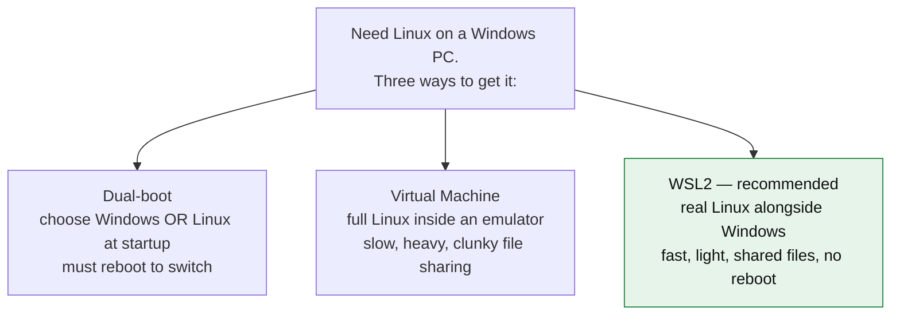
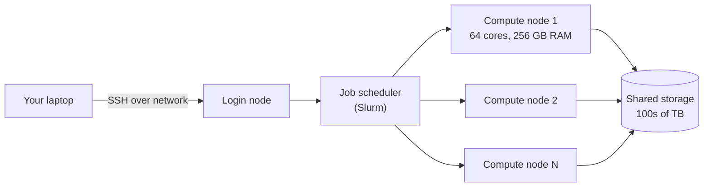
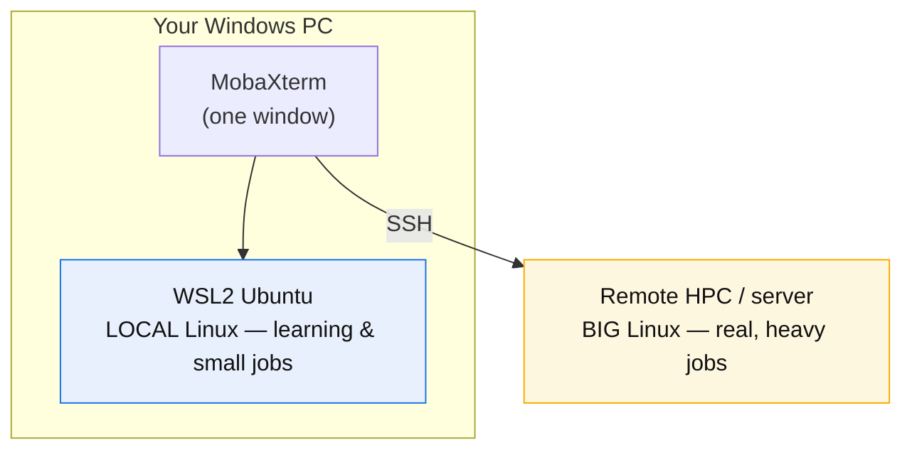

# 🧬 Day 1 — Bioinformatics Workflow Setup: Building Your Computational Foundation
---
> **Week 1, Day 1** · Friday, July 3, 2026  
> **Author:** Naznin  
> 
> **Topics Covered:**
> * Linux Environment Setup (WSL & MobaXterm)
> * Package Management (Miniconda, Bioconda, Pixi, uv)
> * Code Editors (VS Code, RStudio) & AI Assistants
> * Version Control (Git & GitHub)
---
## 🎯 Learning Checklist
By completing this session, I am able to:
- [1] Set up Linux subsystem (WSL2) & MobaXterm
- [2] Configure Conda, Bioconda, Pixi, and uv package managers
- [3] Set up VS Code and RStudio for reproducible coding
- [4] Integrate GitHub Copilot & Claude Code AI tools
- [5] Master basic Git commands and GitHub repository pushing

---
## 🔍 Prerequisites

- **A Windows 10 or Windows 11 PC** with administrator rights and internet.
- **~10 GB free disk** and the patience to reboot once.
- **System Verification:** Open **PowerShell** to verify Windows build compatibility with WSL2:

```powershell
winver
```
> ⚠️ Required version: Version 2004 (build 19041) or higher. Anything from 2021 onward is fine.
---
## 🧠 Fundamental Concepts
### 🐧 What is Linux?
Linux is a **free & open-source operating system (OS)** that manages hardware, memory, and file access. Unlike Windows or macOS, Linux is heavily driven through text commands.

Think of the operating system as the ground floor everything else stands on:

```
   ┌─────────────────────────────────────────┐
   │   Your programs (samtools, R, Python)    │  ← the tools you run
   ├─────────────────────────────────────────┤
   │   Operating System (Linux / Windows)     │  ← manages files, memory, CPU
   ├─────────────────────────────────────────┤
   │   Hardware (CPU, RAM, disk)              │  ← the physical machine
   └─────────────────────────────────────────┘
```
Two ways to give an OS orders:
- **GUI** = *Graphical User Interface* — icons and buttons (what you use on Windows daily).
- **CLI** = *Command-Line Interface* — you type instructions. Bioinformatics lives here.

### 🔓 Why Linux for bioinformatics?

| Reason | What it means |
|--------|-----------------------|
| **Tools are built for it** | Aligners, variant callers, Bioconda's ~10,000 packages ship as Linux binaries first (often *only*). |
| **Free & no admin walls** | Install thousands of tools without buying licenses or fighting admin permissions. |
| **Reproducible & scriptable** | A workflow is just text commands — save them, re-run them, share them, and get identical results. |
| **It runs the big machines** | Lab servers, HPC clusters, and cloud (AWS/Google) are ~all Linux. Learn it once, use it everywhere. |
| **What papers publish** | Methods sections list Linux commands. You can reproduce published pipelines directly. |

---

### 💻 What is WSL? Why WSL?

Problem: Bioinformatics needs Linux, but your laptop runs **Windows**. You have three ways to get Linux onto a Windows PC:



**WSL = Windows Subsystem for Linux.** Version 2 (**WSL2**) runs a **real Ubuntu Linux kernel** seamlessly inside Windows — no separate boot, no clunky emulator. You open a terminal and you are *in Linux*, while Windows keeps running normally beside it.

**Why WSL (over the other two):**

- **No reboot** — Linux and Windows run at the same time.
- **Fast & light** — near-native speed, minimal setup.
- **Shared files** — your Windows files are reachable from Linux and vice-versa.
- **Free & official** — built and maintained by Microsoft; one command installs it.

```
        Your Windows Laptop
   ┌───────────────────────────────┐
   │  Windows apps   │   WSL2       │
   │  (browser,      │   Ubuntu     │
   │   Office, …)    │   (Linux     │
   │                 │    terminal) │
   └───────────────────────────────┘
        both run at the same time
```

So: **WSL2 = your personal Linux, living inside Windows.** This is your *local* Linux for everyday work.

---

### 🚀 What is HPC? Why HPC?
Your laptop is fine for learning, but real datasets are **big** — aligning a human genome can need 32+ GB of RAM and many CPU cores, running for hours. A laptop chokes. Enter **HPC**.

**HPC = High-Performance Computing.** An HPC **cluster** is a large collection of powerful computers ("nodes") wired together in a data center, sharing huge storage — designed to run heavy jobs fast, for many users at once.



Laptop vs HPC, at a glance:

```
   Laptop                         HPC cluster
   ┌──────────┐                   ┌──────────┬──────────┬──────────┐
   │ 4–8 cores│                   │ 64 cores │ 64 cores │ 64 cores │
   │ 8–16 GB  │        vs         │  256 GB  │  256 GB  │  256 GB  │  … ×100s
   │ 1 disk   │                   │   shared petabyte storage      │
   └──────────┘                   └──────────┴──────────┴──────────┘
   good for learning              good for real genomics at scale
```

**Why HPC:**

- **Power** — dozens of cores and hundreds of GB of RAM per node handle genome-scale data.
- **Speed & parallelism** — run many samples at once instead of one-by-one on a laptop.
- **Big storage** — datasets are hundreds of GB to TB; clusters have the room.
- **Runs unattended** — submit a job, log off, collect results later.

**How you reach an HPC:** you do **not** sit in front of it. You connect **remotely from your laptop using SSH** (Step 3). The HPC runs Linux — which is exactly why Steps 1–2 (WSL + MobaXterm) matter: the same Linux skills work locally *and* on the cluster.

---

### 4.6 Putting it together — the two Linuxes

You will use **two** Linux environments, driven from one MobaXterm window:



Same commands, same tools, two places to run them. Today you set up **both paths**.

---

### 4.7 Key terms (all repeated in the Glossary)

- **Operating system (OS)** — master software running a computer (Linux, Windows, macOS).
- **Linux** — free, open-source, command-driven OS that bioinformatics tools target.
- **Terminal / shell** — text window where you type commands; Linux default is **bash**.
- **GUI vs CLI** — point-and-click vs typing commands.
- **WSL2** — *Windows Subsystem for Linux v2*; real Ubuntu inside Windows — your **local** Linux.
- **HPC** — *High-Performance Computing*; a cluster of powerful Linux machines for heavy jobs.
- **SSH** — *Secure Shell*; open a terminal on **another** computer (a server/HPC) over the network.
- **MobaXterm** — Windows app combining local shells, SSH sessions, and file transfer.
- **conda** — installs software + dependencies into isolated **environments**, no admin needed.
- **Bioconda** — a **channel** (catalog) of ~10,000 bioinformatics tools installable via conda.
- **Reproducible** — anyone recreates the same tool versions from a small text file (`environment.yml`, `uv.lock`).
